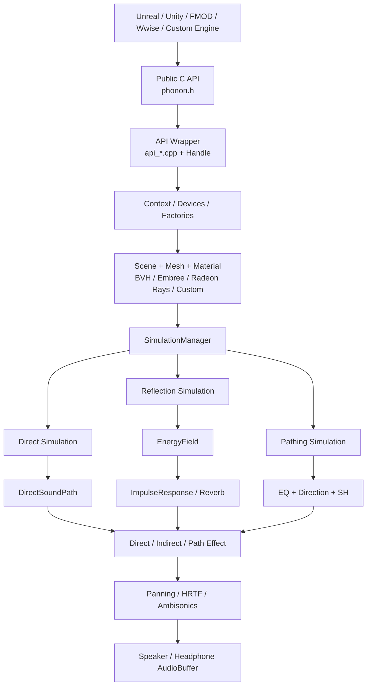
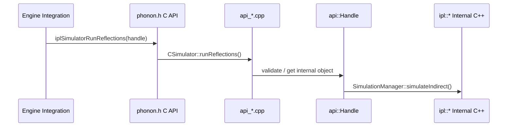
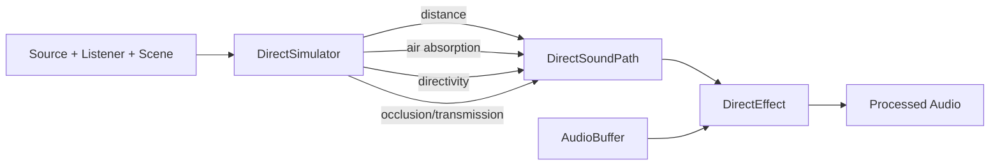
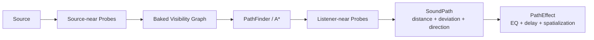
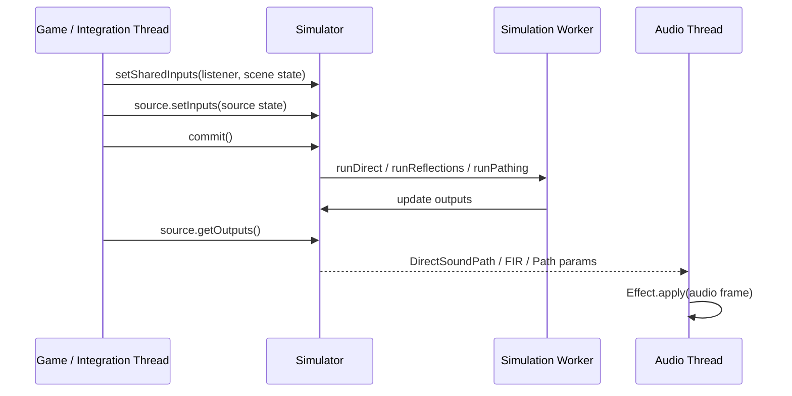

---

# 1. 이 문서의 목적

`core/src/core`에는 수백 개의 파일이 한 폴더에 모여 있다. 파일명만 따라가면 `Scene`, `Simulator`, `Effect`, `Probe`, `HRTF`가 서로 어떤 단계인지 구분하기 어렵다.

이 문서는 [[core_00_overview|Core Overview]]에서 나눈 네 단계를 실제 코드 실행 순서와 세부 파일 단위로 확장한다. 전체 개념을 빠르게 훑고 싶다면 `Core Overview`를 먼저 읽는 것이 좋다.

이 문서에서는 Steam Audio Core를 다음 질문을 기준으로 나눈다.

1. 외부 엔진은 Core를 어디로 호출하는가?
2. Scene geometry는 어떻게 ray tracing 가능한 형태가 되는가?
3. Direct, Reflections, Pathing simulation은 각각 무엇을 계산하는가?
4. Simulation 결과는 어떻게 실제 audio sample에 적용되는가?
5. CPU, Embree, Radeon Rays, OpenCL, TAN 구현은 어디에서 갈리는가?
6. 특정 기능을 더 공부하려면 어떤 소스, 문서, 테스트를 봐야 하는가?

> [!info] 분석 기준
> - Local source: `steam-audio` commit `ecce9cb` (2026-07-13)
> - 주요 기준 파일: `core/src/core/CMakeLists.txt`
> - 참고 사이트: [DeepWiki - ValveSoftware/steam-audio](https://deepwiki.com/ValveSoftware/steam-audio)
>
> DeepWiki는 2026-04-23의 `480dd6`을 기준으로 생성되어 현재 local source와 차이가 있을 수 있다. 동작 판단은 항상 local source를 우선한다.

---

# 2. 가장 먼저 구분해야 하는 것

## 2.1 Simulation과 Effect는 서로 다른 단계다

Steam Audio에서 가장 중요한 구분이다.

| 구분 | 역할 | 입력 | 출력 | 실행 위치의 성격 |
|---|---|---|---|---|
| Simulation | 음향 환경을 계산 | Scene, source, listener, material | 감쇠값, EnergyField, IR, path 정보 | 무겁고 비동기화 가능한 계산 |
| Effect | 계산 결과를 audio sample에 적용 | AudioBuffer + simulation 결과 | 처리된 AudioBuffer | 실시간 audio processing |

예를 들어 차폐를 처리할 때:

```text
DirectSimulator
└─ Scene에 ray를 쏴 occlusion = 0.3 계산

DirectEffect
└─ occlusion 0.3을 실제 audio buffer의 gain/EQ에 적용
```

`DirectSimulator`가 소리를 직접 가공하는 것이 아니며, `DirectEffect`가 ray tracing을 하는 것도 아니다.

## 2.2 Core에는 세 가지 propagation 경로가 있다

| 경로 | 계산 대상 | 대표 출력 | 적용 Effect |
|---|---|---|---|
| Direct | source에서 listener까지의 직접 경로 | 거리 감쇠, 공기 흡수, directivity, occlusion, transmission | `DirectEffect` |
| Reflections | 벽에 반사되어 도달하는 간접음 | `EnergyField`, `ImpulseResponse`, reverb parameter | `IndirectEffect` 내부 convolution/reverb |
| Pathing | 모서리, 문, 복도 등을 거치는 우회 경로 | EQ, 도착 방향, distance ratio, SH coefficients | `PathEffect` |

세 경로는 알고리즘과 결과 자료형이 다르므로 한 개의 “ray tracing 효과”로 묶어 이해하면 안 된다.

---

# 3. 전체 구조



코드를 읽을 때는 위에서 아래로 한 번에 내려가기보다 다음 네 층을 분리해서 보는 것이 좋다.

```text
API Layer        : 외부 ABI, handle, validation
Domain Layer     : Scene, Simulation, Probe, acoustic data
DSP Layer        : AudioBuffer와 Effect
Backend Layer    : SIMD, FFT, Embree, Radeon Rays, OpenCL, TAN
```

---

# 4. 외부 호출에서 실제 구현까지

## 4.1 C API 경계

외부 사용자는 `iplContextCreate`, `iplSceneCreate`, `iplSimulatorRunReflections` 같은 C 함수를 호출한다.



### 포함 파일

| 종류 | 파일 |
|---|---|
| Public ABI | `phonon.h`, `phonon_interfaces.h`, `types.h`, `docs.h` |
| Context/API 기반 | `api_context.h/.cpp`, `context.h/.cpp`, `library.h/.cpp` |
| Scene API | `api_geometry.cpp`, `api_scene.h/.cpp`, `api_serialized_object.h/.cpp` |
| Simulator API | `api_simulator.h/.cpp`, `api_advanced_simulation.cpp`, `api_baking.cpp` |
| Effect API | `api_panning_effect`, `api_binaural_effect`, `api_direct_effect`, `api_indirect_effect`, `api_path_effect`, `api_virtual_surround_effect`, `api_ambisonics_*` |
| Device API | `api_embree_device`, `api_opencl_device`, `api_radeonrays_device`, `api_tan_device` |
| Advanced data API | `api_energy_field`, `api_impulse_response`, `api_reconstructor`, `api_probes` |
| Validation | `api_validation_layer.cpp` |

표에서 확장자가 생략된 이름은 일반적으로 `.h/.cpp` 쌍이다.

### 왜 C API를 사용하는가?

- C ABI는 C++ ABI보다 compiler와 언어 경계를 넘기 쉽다.
- Unity C#, Unreal C++, FMOD, Wwise가 같은 binary interface를 사용할 수 있다.
- public header에서 내부 template, STL container, concrete class를 숨길 수 있다.
- 구현 객체의 수명은 opaque handle과 retain/release로 통제할 수 있다.

### 특이사항

- Public API의 `IPL*` 구조체와 내부 `ipl::*` 타입 사이에서 변환이 발생한다.
- `IPLMatrix4x4`는 row-major, 내부 `Matrix4x4f`는 column-major라 API boundary에서 transpose한다. 자세한 내용은 [[core_matrix]] 참고.
- Validation layer는 항상 본 구현과 같은 의미를 가져야 하므로 API를 추가할 때 같이 갱신해야 한다.
- 대부분의 객체는 `Context`를 통해 만들어진다. allocator, logger, SIMD 정책과 객체 수명 기반을 한곳에서 공유하기 위함이다.

### 더 공부할 곳

- Local docs: `core/doc/context.rst`, `types.rst`, `reference.rst`, `integration.rst`
- Source 시작점: `phonon.h` → `api_context.cpp` → `context.cpp`
- Official: [Steam Audio C API Programmer's Guide](https://valvesoftware.github.io/steam-audio/doc/capi/guide.html)
- DeepWiki: [Core Architecture](https://deepwiki.com/ValveSoftware/steam-audio/2-core-architecture)

---

# 5. 기반 계층: 메모리, Container, Math, Thread

이 계층은 직접적인 음향 기능은 아니지만 거의 모든 상위 모듈이 사용한다.

## 5.1 Runtime와 공통 기반

### 포함 파일

- Platform/runtime: `platform.h`, `types.h`, `error.h`, `log.h/.cpp`
- Memory: `memory_allocator.h/.cpp`
- Profiling: `profiler.h/.cpp`, `null_profiler.h/.cpp`
- Library/context: `library.h/.cpp`, `context.h/.cpp`
- Utility: `util.h`, `pch.h/.cpp`

### 왜 필요한가?

게임 엔진은 자체 allocator, logger, profiler를 사용하는 경우가 많다. Core가 OS 함수나 `new/delete`에 직접 묶이면 integration과 메모리 추적이 어려워지므로 callback과 공통 wrapper를 둔다.

기존 문서: [[core_memory_allocator]], [[core_util]]

## 5.2 Container와 데이터 교환

### 포함 파일

- `array.h`, `containers.h`, `stack.h`
- `triple_buffer.h`
- `serialized_object.h/.cpp`
- `.fbs` schema: `vector`, `sphere`, `triangle`, `material`, `mesh`, `static_mesh`, `scene`, `energy_field`, `reverb`, `probe_batch`, `baked_reflection_data`, `path_visibility`, `path_data`

### 특이사항과 이유

- `Array<T, ...>`는 다차원 contiguous storage를 제공하며 DSP와 simulation buffer에 사용된다.
- `TripleBuffer<T>`는 simulation 쪽 writer와 audio 쪽 reader가 같은 IR을 동시에 수정하지 않도록 `write/share/read` 세 슬롯을 둔다.
- FlatBuffers는 Scene, Probe, Baked Data를 pointer가 없는 binary representation으로 저장한다. 다른 실행 시점에 다시 읽어야 하므로 runtime 객체와 serialization 객체가 분리되어 있다.

기존 문서: [[core_Array]]

## 5.3 Math와 공간 표현

### 포함 파일

- Scalar/vector: `math_functions`, `vector`, `polar_vector`
- Transform: `matrix.h`, `quaternion.h`, `coordinate_space.h`
- Geometry primitive: `box.h`, `sphere.h`
- Sampling: `sampling.h/.cpp`
- SIMD: `float4.h`, `sse_float4.h`, `neon_float4.h`, `float8.h`, `avx_float8.h`
- Vector math backend: `array_math.h/.cpp`, `ipp_array_math.cpp`, `vdsp_array_math.cpp`

### 특이사항과 이유

- 같은 수학 연산을 scalar와 SIMD backend 양쪽에서 사용하도록 추상화한다.
- `CoordinateSpace3f`는 listener/source의 `right`, `up`, `ahead`, `origin`을 묶는다. 방향성, HRTF, Ambisonics 회전에서 기준축이 일치해야 하기 때문이다.
- compile option에 따라 SSE/AVX/NEON 구현이 달라지므로 특정 파일이 모든 platform에서 빌드되는 것은 아니다.

기존 문서: [[core_matrix]], [[core_simd]]

## 5.4 Job system

### 포함 파일

- `job.h`
- `job_graph.h/.cpp`
- `thread_pool.h/.cpp`

### 왜 graph를 사용하는가?

Reflection simulation은 많은 ray job을 병렬로 처리한 후 thread-local EnergyField를 하나로 합쳐야 한다. 단순한 병렬 loop보다 “여러 simulate job이 끝난 뒤 finalize job 실행”이라는 의존 관계를 표현할 수 있어야 한다.

### 더 공부할 곳

- Unit tests: `Array.test.cpp`, `Matrix.test.cpp`, `CoordinateSpace.test.cpp`, `Sampling.test.cpp`
- Core 흐름: `reflection_simulator.cpp`의 job 생성과 `SimulationManager::simulateRealTimeReflections()`
- DeepWiki: [Math & Optimization](https://deepwiki.com/ValveSoftware/steam-audio/2.4-math-and-optimization)

---

# 6. Scene과 Ray Tracing

Scene 계층은 “게임 월드 전체”가 아니라 음향 계산에 필요한 geometry와 material을 ray query 가능한 형태로 제공한다.

## 6.1 포함 파일

| 하위 영역 | 파일 |
|---|---|
| 기하 기본형 | `triangle.h`, `mesh.h/.cpp`, `ray.h/.cpp`, `hit.h`, `material.h` |
| 기본 가속 구조 | `box.h`, `bvh.h/.cpp` |
| Scene 객체 | `static_mesh.h/.cpp`, `instanced_mesh.h/.cpp`, `scene.h/.cpp` |
| Custom backend | `custom_scene.h/.cpp` |
| 생성 선택 | `scene_factory.h/.cpp` |
| Embree | `embree_device`, `embree_static_mesh`, `embree_instanced_mesh`, `embree_scene` |
| Radeon Rays | `radeonrays_device`, `radeonrays_static_mesh`, `radeonrays_scene` |

## 6.2 흐름

```text
Vertex + Triangle + Material
        ↓
StaticMesh 생성
        ↓
Scene에 add
        ↓
Scene::commit()
        ↓
BVH / Embree / Radeon Rays acceleration structure 사용 가능
        ↓
closestHit() / anyHit() / batched query
```

## 6.3 특이사항과 이유

### `commit()`이 따로 있다

`addStaticMesh()`를 호출할 때마다 BVH나 backend scene을 즉시 다시 만들면 여러 개의 변경을 적용할 때 비용이 반복된다. 변경을 모아 두었다가 `commit()`에서 읽기 가능한 snapshot으로 확정한다.

### `closestHit`과 `anyHit`을 나눈다

- `closestHit`: 반사 위치, normal, material이 필요할 때 가장 가까운 교차점을 구함
- `anyHit`: source-listener 사이가 막혔는지만 알면 될 때 첫 교차에서 종료 가능

Occlusion에 `closestHit`을 사용하면 필요 없는 계산이 늘어난다.

### InstancedMesh는 mesh가 아니라 ray를 변환한다

여러 instance에 대해 geometry/BVH를 복제하지 않는다. World-space ray를 inverse transform으로 sub-scene local space에 보낸 뒤 hit를 다시 world space로 돌린다.

자세한 내용: [[core_mesh]], [[core_bvh]], [[core_scene]], [[core_instanced_mesh]], [[core_matrix]]

## 6.4 더 공부할 곳

- Local docs: `core/doc/geometry.rst`, `scene.rst`, `embree.rst`, `radeon-rays.rst`
- Unit tests: `Mesh.test.cpp`, `BVH.test.cpp`, `Scene.test.cpp`, `RayTracerCompare.test.cpp`
- Interactive: `itest_bvh.cpp`, `itest_instancedmesh.cpp`, `itest_raytracer.cpp`
- Benchmark: `benchmark_scene.cpp`, `benchmark_raytracer.cpp`
- Official: [Steam Audio Scene](https://valvesoftware.github.io/steam-audio/doc/capi/scene.html)

---

# 7. Direct Sound

Direct Sound는 source와 listener 사이의 한 경로에 대한 값을 계산한다.

## 7.1 포함 파일

### Simulation model

- `propagation_medium.h`
- `distance_attenuation.h/.cpp`
- `air_absorption.h/.cpp`
- `directivity.h/.cpp`
- `direct_simulator.h/.cpp`

### Audio 적용

- `gain_effect.h/.cpp`
- `eq_effect.h/.cpp`
- `delay_effect.h/.cpp`
- `direct_effect.h/.cpp`
- API: `api_direct_effect.h/.cpp`

## 7.2 코드 흐름



## 7.3 특이사항과 이유

- 거리 감쇠, directivity, scalar occlusion은 전체 gain으로 합칠 수 있다.
- 공기 흡수와 frequency-dependent transmission은 band별 값이 다르므로 EQ가 필요하다.
- `DirectEffect`는 EQ가 필요 없는 경우 `GainEffect`만 사용하여 불필요한 filtering을 피한다.
- Occlusion은 “막힘 정도”, transmission은 “막힌 물질을 통과하는 정도”이므로 같은 값이 아니다.
- Delay 값은 `DirectSoundPath`에 있지만 적용 여부와 integration 방식은 caller의 설정과 effect pipeline을 함께 봐야 한다.

기존 문서: [[core_direct_effect]], [[core_eqeffect]], [[core_delay_effect]]

## 7.4 더 공부할 곳

- Local docs: `core/doc/simulation.rst`, `direct-effect.rst`
- Unit test: `DirectSimulator.test.cpp`
- Interactive: `itest_directsimulator.cpp`, `itest_directsoundeffect.cpp`, `itest_energycurves.cpp`
- Benchmark: `benchmark_directsoundeffect.cpp`
- Source 순서: `direct_simulator.cpp` → `DirectSoundPath` → `direct_effect.cpp`

---

# 8. Reflections와 Reverb

Reflection은 Core에서 가장 긴 pipeline이다. Ray tracing 결과를 즉시 audio sample로 쓰지 않고 중간 표현을 여러 번 바꾼다.

## 8.1 전체 흐름

```mermaid
flowchart LR
    Scene["Scene + Materials"]
    Rays["ReflectionSimulator<br/>Monte Carlo Rays"]
    EF["EnergyField<br/>time × band × SH"]
    Acc["Frame Accumulation"]
    Recon["Reconstructor"]
    IR["ImpulseResponse"]
    Partition["OverlapSave Partitioner"]
    FIR["TripleBuffer&lt;OverlapSaveFIR&gt;"]
    Effect["IndirectEffect"]
    Audio["Wet Audio"]

    Scene --> Rays --> EF --> Acc --> Recon --> IR --> Partition --> FIR --> Effect --> Audio
```



## 8.2 포함 파일

| 단계 | 파일 |
|---|---|
| Energy representation | `energy_field.h/.cpp`, `energy_field_factory.h/.cpp` |
| Ray simulation | `reflection_simulator.h/.cpp`, `reflection_simulator_factory.h/.cpp` |
| CPU/accelerated simulator | `embree_reflection_simulator`, `radeonrays_reflection_simulator.cpp/.h/.cl` |
| IR | `impulse_response.h/.cpp`, `impulse_response_factory.h/.cpp` |
| Reconstruction | `reconstructor.h/.cpp`, `reconstructor_factory.h/.cpp`, `opencl_reconstructor` |
| Reverb parameter | `reverb_estimator.h/.cpp`, `hybrid_reverb_estimator.h/.cpp`, `reverb.fbs` |
| Convolution | `overlap_add_convolution_effect`, `overlap_save_convolution_effect` |
| Parametric/hybrid | `delay.h/.cpp`, `reverb_effect.h/.cpp`, `hybrid_reverb_effect.h/.cpp` |
| Unified effect | `indirect_effect.h/.cpp`, `api_indirect_effect.h/.cpp` |

## 8.3 왜 EnergyField를 거치는가?

Ray tracing으로 얻는 것은 완성된 waveform이 아니라 “언제, 어느 주파수 대역의 에너지가, 어느 방향에서 얼마나 도착했는가”에 가깝다.

`EnergyField`는 이 통계적 결과를 저장하고 `Reconstructor`가 phase를 가진 time-domain IR로 변환한다.

```text
EnergyField: 물리 simulation에 유리한 통계 표현
ImpulseResponse: convolution에 필요한 신호 표현
```

두 책임을 분리하면 simulation backend와 audio convolution backend를 독립적으로 교체할 수 있다.

## 8.4 왜 여러 frame을 누적하는가?

Monte Carlo ray tracing은 ray 수가 유한해 noise가 생긴다. `SimulationManager::accumulateEnergyFields()`는 여러 simulation frame을 평균하여 갑작스러운 변화와 noise를 줄인다.

대신 source/listener/scene이 크게 변하면 이전 결과를 계속 섞으면 ghosting이 생길 수 있으므로 변경 여부와 누적 상태를 관리한다.

## 8.5 Convolution, Parametric, Hybrid

| 방식 | 장점 | 비용/한계 |
|---|---|---|
| Convolution | 실제 IR의 early reflection과 공간 특성을 유지 | 긴 IR은 FFT와 memory 비용이 큼 |
| Parametric | 긴 reverb tail을 저렴하게 생성 | 실제 공간의 세부 reflection을 단순화 |
| Hybrid | early는 convolution, late는 parametric | transition과 EQ/delay 추정이 필요 |

`IndirectEffect`가 effect type에 따라 이 구현들을 선택한다.

## 8.6 왜 partition과 TripleBuffer가 필요한가?

- 긴 IR 전체를 매 audio frame마다 직접 convolution하면 비싸다.
- Overlap-save 방식은 IR을 FFT block으로 partition하여 frame 기반 processing에 맞춘다.
- Simulation thread가 새 IR partition을 만드는 동안 audio thread가 기존 partition을 읽을 수 있어야 한다.
- `TripleBuffer<OverlapSaveFIR>`가 write/share/read 역할을 분리해 전달한다.

## 8.7 더 공부할 곳

- Local docs: `energy-field.rst`, `impulse-response.rst`, `reconstructor.rst`, `reflections-effect.rst`
- Unit tests: `EnergyField.test.cpp`, `ImpulseResponse.test.cpp`, `ReflectionSimulator.test.cpp`, `ConvolutionEffect.test.cpp`
- Interactive: `itest_energyfield.cpp`, `itest_impulseresponse.cpp`, `itest_convolutioneffect.cpp`, `itest_hybridreverbeffect.cpp`, `itest_parametricreverb.cpp`
- Benchmark: `benchmark_reflections.cpp`, `benchmark_reconstruction.cpp`, `benchmark_convolution.cpp`, `benchmark_reverb.cpp`
- DeepWiki: [Simulation Engine](https://deepwiki.com/ValveSoftware/steam-audio/2.2-simulation-engine)

---

# 9. Probe와 Baking

Probe는 공간의 특정 위치에 미리 계산한 acoustic data를 저장하기 위한 sample point다.

## 9.1 포함 파일

### Probe 구조

- `probe.h`
- `probe_generator.h/.cpp`
- `octree_probes.h/.cpp`
- `probe_tree.h/.cpp`
- `probe_data.h`
- `probe_batch.h/.cpp/.fbs`
- `probe_manager.h/.cpp`

### Reflection baking

- `baked_reflection_data.h/.cpp/.fbs`
- `reflection_baker.h/.cpp`
- `baked_reflection_simulator.h/.cpp`
- API: `api_probes`, `api_baking.cpp`

## 9.2 흐름

```text
Scene volume
   ↓ ProbeGenerator
Probe positions
   ↓ ReflectionBaker / Path bake
Probe별 baked acoustic data
   ↓ serialize ProbeBatch
Runtime listener/source 주변 probe lookup
   ↓ interpolation
Reflection 또는 Pathing output
```

## 9.3 특이사항과 이유

- Baking은 runtime CPU 비용을 저장 공간과 authoring 시간으로 옮긴다.
- Probe 간격이 작으면 정확도와 data 크기가 증가하고, 크면 공간 변화가 뭉개진다.
- Runtime에서는 listener 한 점과 정확히 일치하는 probe를 찾는 것이 아니라 주변 probe의 결과를 보간한다.
- `ProbeTree`는 많은 probe 중 근처 probe를 빠르게 찾기 위한 공간 검색 구조다.
- Baked reflection과 realtime reflection은 입력 source/listener의 움직임 조건과 baked data variation이 다르므로 identifier를 정확히 맞춰야 한다.

## 9.4 더 공부할 곳

- Local docs: `probes.rst`, `baking.rst`, `serialization.rst`
- Unit test: `ProbeTree.test.cpp`
- Interactive: `itest_probes.cpp`, `itest_bakedindirect.cpp`
- Benchmark: `benchmark_baking.cpp`, `benchmark_probelookup.cpp`
- Official: [Steam Audio Probes](https://valvesoftware.github.io/steam-audio/doc/capi/probes.html)

---

# 10. Pathing

Pathing은 source와 listener 사이에 직선이 없을 때 probe graph 위에서 소리가 돌아오는 경로를 계산한다.

## 10.1 포함 파일

- Cost/model: `deviation.h/.cpp`
- Graph visibility: `path_visibility.h/.cpp/.fbs`
- Search: `path_finder.h/.cpp`
- Result: `path_data.h/.cpp/.fbs`
- Simulation: `path_simulator.h/.cpp`
- Audio processing: `path_effect.h/.cpp`, `api_path_effect.h/.cpp`
- Probe 연동: `probe_batch`, `probe_manager`, `api_baking.cpp`

## 10.2 흐름



## 10.3 특이사항과 이유

- Geometry triangle 전체를 search node로 쓰지 않고 probe graph를 사용한다. Runtime path search 규모를 제한하기 위함이다.
- A* heuristic은 빠른 탐색을 위한 것이며 path cost 정의가 실제 음향 품질에 직접 영향을 준다.
- `simplifyPaths`는 불필요한 중간 node를 제거하지만 visibility validation과 함께 이해해야 한다.
- Pathing이 geometric diffraction wave equation을 직접 푸는 것은 아니다. Probe visibility와 deviation model을 이용한 실용적 근사다.
- 출력에는 단순 gain뿐 아니라 도착 방향과 SH coefficient가 포함된다. 소리가 실제 source 방향이 아니라 문이나 코너 방향에서 들리게 해야 하기 때문이다.

기존 문서: [[core_path_finder]]

## 10.4 더 공부할 곳

- Local docs: `path-effect.rst`, `baking.rst`
- Interactive: `itest_pathing.cpp`
- Benchmark: `benchmark_astar.cpp`, `benchmark_pathing.cpp`, `benchmark_pathingbake.cpp`, `benchmark_patheffect.cpp`
- Source 순서: `path_visibility` → `path_finder` → `path_data` → `path_simulator` → `path_effect`

---

# 11. Audio Buffer와 공간 렌더링

Simulation 결과가 준비된 뒤 실제 sample을 처리하는 계층이다.

## 11.1 DSP 기반 파일

- Audio data: `audio_buffer.h/.cpp`
- Frequency bands: `bands.h/.cpp`
- Filter/window: `window_function`, `iir`
- FFT interface/backend: `fft.h`, `ipp_fft.cpp`, `ffts_fft.cpp`, `pffft_fft.cpp`, `vdsp_fft.cpp`
- Basic effect: `gain_effect`, `eq_effect`, `delay_effect`, `delay`
- AVX specialization: `float8_iir.cpp`, `float8_delay.cpp`, `float8_reverb_effect.cpp`

## 11.2 Panning과 HRTF

### 포함 파일

- Speaker: `speaker_layout.h/.cpp`, `panning_effect.h/.cpp`
- HRTF loading: `hrtf_map`, `sofa_hrtf_map`, `hrtf_map_factory`, `hrtf_database`, `cipic_124.inl`, `hrtf.cpp`
- Binaural: `binaural_effect.h/.cpp`
- Multi-channel binaural: `virtual_surround_effect.h/.cpp`

### 이유와 특이사항

- Panning은 speaker gain을 계산하는 반면 Binaural은 귀별 HRTF convolution을 수행한다.
- HRTF는 방향마다 다르므로 nearest-neighbor 또는 interpolation 정책이 필요하다.
- `VirtualSurroundEffect`는 각 virtual speaker를 개별 binaural source처럼 처리한 뒤 stereo로 합친다.
- HRTF 교체나 방향 변화 시 filter가 급변하면 click이 날 수 있어 convolution state와 interpolation/crossfade가 중요하다.

기존 문서: [[core_audiobuffer]], [[core_panning_effect]]

## 11.3 Ambisonics

### 포함 파일

- Spherical harmonics: `sh.h/.cpp`, `sh/spherical_harmonics.h/.cc`
- Encode: `ambisonics_encode_effect`
- Rotate: `ambisonics_rotate_effect`
- Speaker decode: `ambisonics_panning_effect`
- Binaural decode: `ambisonics_binaural_effect`
- Unified decode: `ambisonics_decode_effect`
- 각 effect의 `api_ambisonics_*` wrapper

### 처리 순서

```text
Mono point source
   ↓ Encode
Ambisonics channels
   ↓ Rotate by listener orientation
Rotated Ambisonics
   ├─ Panning decode → speakers
   └─ Binaural decode → headphones
```

### 특이사항과 이유

- Ambisonics order가 올라가면 방향 해상도가 좋아지지만 channel 수는 $(order + 1)^2$로 증가한다.
- `DynamicMatrixf`는 order와 speaker layout에 따라 달라지는 decode matrix에 사용된다.
- channel ordering과 normalization(SN3D/N3D)을 혼동하면 방향과 gain이 틀어진다. `AudioBuffer`의 변환 함수도 함께 봐야 한다.

## 11.4 Effect 공통 패턴

대부분의 Effect는 다음 구조를 가진다.

```text
Settings : 생성 후 바뀌지 않는 최대 크기/채널/format
Params   : 매 apply마다 바뀌는 방향/gain/filter/IR
apply()  : 입력 frame 처리
tail()   : 입력 종료 후 남은 delay/reverb 출력
reset()  : 내부 history 초기화
```

고정 설정과 frame별 parameter를 분리하면 audio callback 안에서 재할당과 객체 재생성을 피할 수 있다.

`tail()`이 필요한 이유는 convolution, delay, reverb 내부에 이전 sample의 에너지가 남기 때문이다. 입력이 끝났다고 출력을 즉시 끄면 반사음과 잔향이 잘린다.

## 11.5 더 공부할 곳

- Local docs: `audio-buffers.rst`, `hrtf.rst`, `panning-effect.rst`, `binaural-effect.rst`, `ambisonics-*.rst`, `virtual-surround-effect.rst`
- Unit tests: `AudioBuffer.test.cpp`, `BinauralEffect.test.cpp`, `HRTFDatabase.test.cpp`, `SphericalHarmonics.test.cpp`
- Interactive: `itest_binauraleffect.cpp`, `itest_panningeffect.cpp`, `itest_ambisonics*.cpp`, `itest_virtualsurroundeffect.cpp`
- DeepWiki: [Audio Effects](https://deepwiki.com/ValveSoftware/steam-audio/2.3-audio-effects)

---

# 12. SimulationManager: 세 경로를 묶는 중앙 조정자

## 12.1 포함 파일

- `simulation_data.h/.cpp`
- `simulation_manager.h/.cpp`
- `api_simulator.h/.cpp`
- Factories: `scene_factory`, `energy_field_factory`, `impulse_response_factory`, `reflection_simulator_factory`, `reconstructor_factory`, `hrtf_map_factory`
- Scheduling: `job`, `job_graph`, `thread_pool`

## 12.2 Public API 실행 순서



## 12.3 `commit()`이 중요한 이유

Input update와 simulation read가 같은 container를 동시에 만지지 않도록 작성 중인 source/probe 목록과 simulation이 읽는 목록을 분리한다.

```text
setInputs / addSource / addProbeBatch
               ↓
          editing state
               ↓ commit
         simulation state
```

`commit()`은 “GPU에 보낸다”는 뜻으로만 이해하면 안 된다. 여러 subsystem에서 변경 사항을 읽기 가능한 snapshot으로 확정하는 synchronization boundary 역할을 한다.

## 12.4 Reflection 결과 전달

```text
SimulationManager
  → EnergyField 누적
  → IR reconstruction
  → OverlapSave partition
  → TripleBuffer.writeBuffer
  → commitWriteBuffer()

Audio Effect
  → updateReadBuffer()
  → 새 FIR이 있으면 교체
  → convolution
```

무거운 IR 생성과 실시간 audio processing을 같은 thread에서 수행하지 않기 위한 구조다.

## 12.5 더 공부할 곳

- 가장 중요한 source: `api_simulator.cpp`, `simulation_data.h`, `simulation_manager.cpp`
- 흐름 확인용: `core/src/benchmark/benchmark_convolution.cpp`
- 전체 integration 예시: `core/doc/guide.rst`, `integration.rst`, `simulation.rst`

---

# 13. Backend와 Hardware Acceleration

Backend 파일은 독립된 기능 카테고리라기보다 Scene, Reflection, Reconstruction, Convolution의 대체 구현이다.

| Backend | 담당 | 주요 파일 |
|---|---|---|
| Built-in CPU | BVH, reflection, reconstruction | `bvh`, `scene`, `reflection_simulator`, `reconstructor` |
| Embree | CPU ray tracing | `embree_device`, `embree_scene`, `embree_*mesh`, `embree_reflection_simulator.cpp/.ispc` |
| Radeon Rays | OpenCL GPU ray tracing | `radeonrays_device`, `radeonrays_scene`, `radeonrays_static_mesh`, `radeonrays_reflection_simulator.cpp/.cl` |
| OpenCL | GPU buffer/IR/reconstruction 기반 | `opencl_device`, `opencl_buffer`, `opencl_kernel`, `opencl_energy_field`, `opencl_impulse_response`, `opencl_reconstructor` |
| TrueAudio Next | GPU convolution | `tan_device`, `tan_convolution_effect` |
| FFT backend | frequency-domain DSP | `ipp_fft`, `ffts_fft`, `pffft_fft`, `vdsp_fft` |
| SIMD | vectorized CPU DSP/math | `sse_float4`, `neon_float4`, `avx_float8`, `float8_*` |

## 13.1 Factory를 두는 이유

상위 `SimulationManager`가 `if Embree`, `if RadeonRays`를 모든 함수에 반복하지 않도록 생성 시점에 interface 구현을 선택한다.

```text
SceneFactory::create(SceneType)
   ├─ Scene
   ├─ EmbreeScene
   ├─ RadeonRaysScene
   └─ CustomScene
```

Factory와 interface 분리는 algorithm code를 유지한 채 storage/device backend만 바꿀 수 있게 한다.

## 13.2 특이사항

- Backend는 compile-time option과 runtime setting 양쪽의 영향을 받는다.
- CMake option이 꺼져 있으면 enum 값이 있어도 concrete implementation이 binary에 없을 수 있다.
- GPU ray tracing과 GPU convolution은 같은 기능이 아니다. Radeon Rays와 TAN을 구분해야 한다.
- 결과 비교는 성능 benchmark만으로 부족하다. `RayTracerCompare.test.cpp`처럼 backend 간 수치 결과도 확인해야 한다.

## 13.3 더 공부할 곳

- Build selection: `core/src/core/CMakeLists.txt`
- Local docs: `embree.rst`, `opencl.rst`, `radeon-rays.rst`, `trueaudio-next.rst`
- Test: `RayTracerCompare.test.cpp`
- Benchmark: `benchmark_raytracer.cpp`, `benchmark_reflections.cpp`, `benchmark_convolution.cpp`

---

# 14. 추천 학습 순서

## 단계 1: API 사용 흐름

1. `core/doc/getting-started.rst`
2. `core/doc/guide.rst`
3. `phonon.h`
4. `api_context.cpp`, `api_scene.cpp`, `api_simulator.cpp`

목표: 객체 생성 순서와 `Settings → Create → Params → Apply/Run → Release` 패턴 이해.

## 단계 2: Geometry와 Direct Sound

1. [[core_mesh]]
2. [[core_bvh]]
3. [[core_scene]]
4. [[core_instanced_mesh]]
5. `direct_simulator.cpp`
6. [[core_direct_effect]]

목표: Scene ray query 결과가 audio gain/EQ가 되는 가장 짧은 end-to-end 경로 이해.

## 단계 3: Audio rendering

1. [[core_audiobuffer]]
2. [[core_panning_effect]]
3. `hrtf_map.cpp`, `hrtf_database.cpp`
4. `binaural_effect.cpp`
5. `ambisonics_*_effect.cpp`

목표: 위치와 방향이 speaker/headphone sample로 바뀌는 과정 이해.

## 단계 4: Reflection

1. `reflection_simulator.cpp`
2. `energy_field.cpp`
3. `reconstructor.cpp`
4. `impulse_response.cpp`
5. `overlap_save_convolution_effect.cpp`
6. `indirect_effect.cpp`
7. `simulation_manager.cpp`

목표: Ray → EnergyField → IR → FIR partition → wet audio 전체 연결.

## 단계 5: Baking과 Pathing

1. `probe_generator.cpp`, `probe_tree.cpp`, `probe_batch.cpp`
2. `reflection_baker.cpp`, `baked_reflection_simulator.cpp`
3. `path_visibility.cpp`
4. [[core_path_finder]]
5. `path_simulator.cpp`, `path_effect.cpp`

목표: offline 계산 결과를 runtime에서 lookup/interpolation하는 구조 이해.

## 단계 6: Optimization과 Backend

1. [[core_simd]]
2. `job_graph.cpp`, `thread_pool.cpp`
3. `scene_factory.cpp`, `reflection_simulator_factory.cpp`
4. Embree/Radeon Rays/OpenCL/TAN 구현 비교
5. `benchmark/` 결과 확인

목표: 동일한 기능이 platform과 device에 따라 어떻게 교체되는지 이해.

---

# 15. 문서를 읽는 방법

## 구현을 알고 싶을 때

```text
public function in phonon.h
    ↓ 같은 이름의 api_*.cpp
internal class/interface
    ↓ factory 또는 concrete implementation
unit test / itest / benchmark
```

## 이론을 알고 싶을 때

| 주제 | 먼저 볼 문서 | 그 다음 볼 코드 |
|---|---|---|
| BVH/ray tracing | [[core_bvh]] | `bvh.cpp`, `RayTracerCompare.test.cpp` |
| 좌표 변환 | [[core_matrix]], [[core_instanced_mesh]] | `matrix.h`, `instanced_mesh.cpp` |
| Direct sound | `simulation.rst`, [[core_direct_effect]] | `direct_simulator.cpp`, `direct_effect.cpp` |
| HRTF | `hrtf.rst`, `binaural-effect.rst` | `hrtf_database.cpp`, `binaural_effect.cpp` |
| Ambisonics | `ambisonics-*.rst` | `sh.cpp`, `ambisonics_*_effect.cpp` |
| Reflection/IR | `energy-field.rst`, `reconstructor.rst` | `reflection_simulator.cpp`, `reconstructor.cpp` |
| Convolution | `reflections-effect.rst` | `overlap_save_convolution_effect.cpp` |
| Reverb | Reflection/IR 문서 | `reverb_estimator.cpp`, `reverb_effect.cpp` |
| Probe/Baking | `probes.rst`, `baking.rst` | `probe_*`, `reflection_baker.cpp` |
| A*/Pathing | [[core_path_finder]] | `path_finder.cpp`, `path_simulator.cpp` |
| Thread handoff | 이 문서 12장 | `simulation_manager.cpp`, `triple_buffer.h` |

## 결과를 눈과 귀로 확인하고 싶을 때

- `src/test`: 작은 수학적/구조적 정답 검증
- `src/itest`: 시각화 또는 실제 audio 청취
- `src/benchmark`: 설정 변화에 따른 비용 측정
- `src/samples`: 최소 API 사용 예시

소리 관련 코드는 구현만 읽는 것보다 `itest`의 입력 설정과 출력 파형/청취 결과를 함께 보는 편이 훨씬 이해가 빠르다.

---

# 16. 핵심 정리

Steam Audio Core의 중심은 다음 한 문장으로 정리할 수 있다.

> Scene geometry에서 음향 propagation parameter를 계산하고, 그 결과를 audio thread에 안전하게 전달하여 DSP Effect로 적용하는 library다.

전체 구조를 다시 축약하면 다음과 같다.

```text
phonon.h / api_*        외부 언어와 Core의 경계
Context / Factory      수명, allocator, backend 선택
Scene / Mesh / BVH     음향 geometry와 ray query
SimulationManager      Direct / Reflection / Pathing 조정
EnergyField / IR       반사 결과의 중간 표현
Probe / Baking         offline 계산과 runtime lookup
Effect / AudioBuffer   실제 sample 처리
SIMD / FFT / GPU       같은 계산을 빠르게 수행하는 backend
```

처음부터 모든 파일을 읽기보다 `Direct Sound`로 가장 짧은 전체 흐름을 익힌 뒤 `Reflection`, `Baking`, `Pathing` 순으로 확장하는 것이 좋다.
