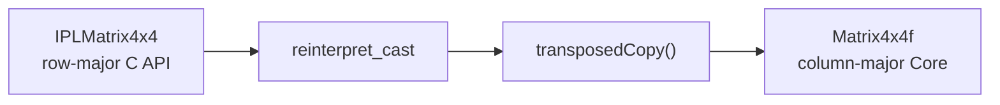
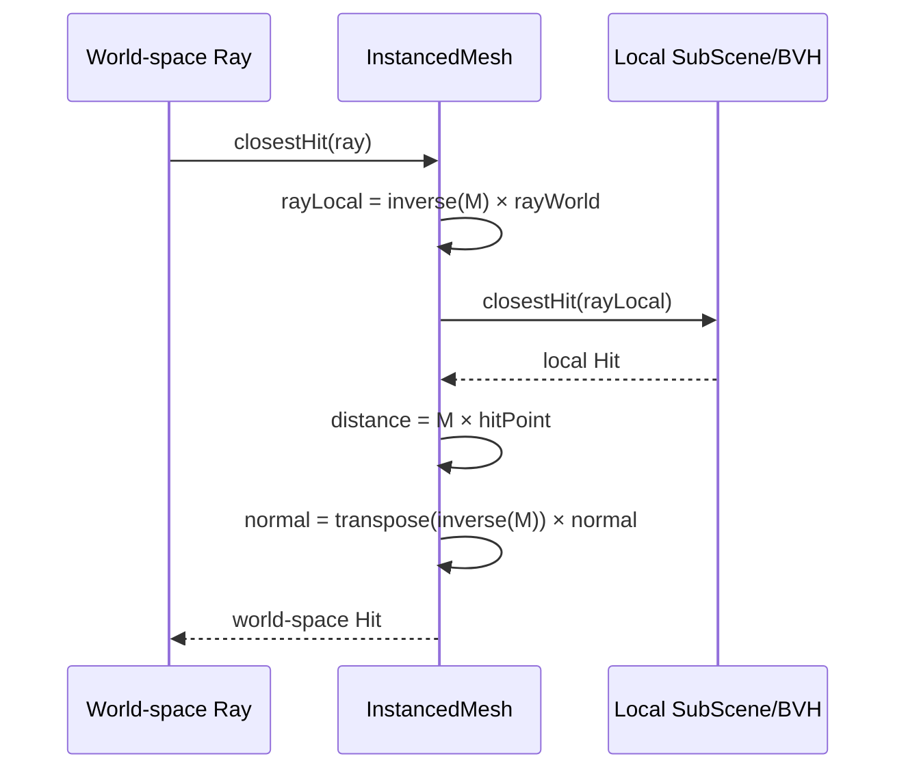

---

# 1. Introduction

Steam Audio의 `matrix.h`는 다음 두 종류의 행렬을 제공하는 <strong style="color:#b3f594">header-only 수학 모듈</strong>이다.

- `Matrix<T, R, C>`
  - 크기가 컴파일 타임에 정해지는 고정 크기 행렬
  - 원소를 stack에 저장
- `DynamicMatrix<T>`
  - 실행 중에 행과 열의 크기를 정하는 동적 행렬
  - 원소를 `vector<T>`에 저장

`SquareMatrix`, determinant, inverse, 행렬 곱셈도 모두 `matrix.h`에 구현되어 있으며 별도의 `matrix.cpp`는 존재하지 않는다.

> [!info] Steam Audio에서 행렬이 필요한 이유
> 행렬은 단순한 범용 수학 유틸리티가 아니다.
>
> - `InstancedMesh`의 local/world 좌표 변환
> - Public C API의 row-major 행렬과 내부 column-major 행렬 변환
> - Ambisonics 채널을 실제 스피커 채널로 디코딩
> - 구면 조화 함수 회전 및 행렬 연산
> - MKL을 사용한 least-squares 계산
>
> 등에 직접 사용된다.

---

# 2. 행렬 이론

## 2.1 행렬은 공간을 바꾸는 함수

행렬 $M$과 벡터 $v$의 곱은 벡터를 새로운 좌표로 변환한다.

$$
v' = Mv
$$

예를 들어 다음 $2 \times 3$ 행렬은 3차원 벡터를 2차원 벡터로 변환한다.

$$
M =
\begin{bmatrix}
1 & -1 & 2 \\
0 & -3 & 1
\end{bmatrix},
\qquad
v =
\begin{bmatrix}
2 \\ 1 \\ 0
\end{bmatrix}
$$

$$
Mv =
\begin{bmatrix}
1 \times 2 + (-1) \times 1 + 2 \times 0 \\
0 \times 2 + (-3) \times 1 + 1 \times 0
\end{bmatrix}
=
\begin{bmatrix}
1 \\ -3
\end{bmatrix}
$$

Steam Audio의 `Matrix * Vector`도 이 표준 정의를 그대로 구현한다.

## 2.2 행렬 곱셈

$A$가 $R \times C$, $B$가 $C \times C_2$ 크기라면 결과는 $R \times C_2$가 된다.

$$
(AB)_{ij} = \sum_{k=0}^{C-1} A_{ik}B_{kj}
$$

중간 차원인 `A의 열 개수`와 `B의 행 개수`가 같아야 한다.

```text
Matrix<T, R, C> × Matrix<T, C, C2>
                     ↓
             Matrix<T, R, C2>
```

행렬 곱셈은 교환 법칙이 성립하지 않는다.

$$
AB \neq BA
$$

따라서 좌표 변환을 여러 번 적용할 때 행렬의 순서가 바뀌면 결과도 달라진다.

## 2.3 4x4 affine transform과 동차 좌표

3D 공간에서 회전, 크기, 이동을 하나의 행렬로 표현하기 위해 4차원 동차 좌표를 사용한다.

$$
\begin{bmatrix}
x' \\ y' \\ z' \\ 1
\end{bmatrix}
=
\begin{bmatrix}
 & & & t_x \\
 & R & & t_y \\
 & & & t_z \\
0 & 0 & 0 & 1
\end{bmatrix}
\begin{bmatrix}
x \\ y \\ z \\ 1
\end{bmatrix}
$$

- 점(position): $w = 1$ → translation의 영향을 받음
- 방향(direction): $w = 0$ → translation의 영향을 받지 않음

Steam Audio의 `Vector4(const Vector3<T>&)`는 입력을 점으로 간주하여 자동으로 `w = 1`을 설정한다.

```cpp
Vector4(const Vector3<T>& values)
{
    this->elements[0] = values.x();
    this->elements[1] = values.y();
    this->elements[2] = values.z();
    this->elements[3] = 1;
}
```

방향이나 normal을 변환할 때는 명시적으로 `w = 0`인 `Vector4f`를 만든다.

## 2.4 역행렬과 normal matrix

행렬 $M$으로 local 좌표를 world 좌표로 보냈다면 역행렬 $M^{-1}$은 다시 local 좌표로 되돌린다.

$$
p_{world} = Mp_{local}
$$

$$
p_{local} = M^{-1}p_{world}
$$

하지만 surface normal은 일반 벡터처럼 $M$을 곱하면 안 된다. 특히 non-uniform scale이 포함되면 normal과 표면의 수직 관계가 깨진다.

따라서 normal은 inverse-transpose를 사용한다.

$$
n_{world} = (M^{-1})^T n_{local}
$$

---

# 3. 구성 요소

| 타입 | 크기 결정 | 저장 위치 | 주요 용도 |
|---|---:|---|---|
| `Matrix<T, R, C>` | compile time | stack | 고정 크기 행렬, 행렬/벡터 곱 |
| `SquareMatrix<T, N>` | compile time | stack | identity, transpose, determinant, inverse |
| `Matrix4x4f` | compile time | stack | InstancedMesh affine transform |
| `DynamicMatrix<T>` | runtime | heap | Ambisonics decoding, 가변 크기 연산 |
| `DynamicMatrixf/d` + MKL | runtime | heap | BLAS 곱셈, least-squares, L1 solver |

## 3.1 `Matrix<T, R, C>`

```cpp
template <typename T, const int R, const int C>
class Matrix
{
public:
    static const int kNumRows = R;
    static const int kNumCols = C;
    static const int kNumElements = R * C;

    T elements[R * C];
};
```

행과 열이 template 인자이므로 다음 정보가 컴파일 타임에 결정된다.

- 필요한 메모리 크기
- 행렬 곱셈이 가능한 차원
- 연산의 반환 타입

예를 들어 다음 곱셈의 결과 타입은 자동으로 `Matrix<float, 2, 4>`가 된다.

```cpp
Matrix<float, 2, 3> a;
Matrix<float, 3, 4> b;

auto c = a * b; // Matrix<float, 2, 4>
```

> [!warning] 기본 생성자는 초기화하지 않는다
> `Matrix()`는 `elements`를 0으로 만들지 않는다.
>
> 값을 누적하기 전에 `zero()`를 호출하거나 `zeroMatrix()`를 사용해야 한다.

## 3.2 `SquareMatrix<T, N>`

정방 행렬 전용 기능을 추가한다.

- `identity()` / `identityMatrix()`
- `transpose()`
- 2x2, 3x3, 4x4 determinant
- 4x4 inverse

```cpp
auto identity = Matrix4x4f::identityMatrix();
```

## 3.3 `DynamicMatrix<T>`

```cpp
template <typename T>
class DynamicMatrix
{
public:
    vector<T> elements;
    int numRows;
    int numCols;
};
```

고정 행렬과 달리 실행 중에 크기를 정할 수 있다.

```cpp
DynamicMatrixf channelsToSpeakers(numSpeakers, numAmbisonicsChannels);
```

Steam Audio에서는 Ambisonics order나 speaker 개수처럼 runtime에 결정되는 차원에 사용한다.

---

# 4. 메모리 배치: Column-major

Steam Audio 내부 행렬은 <strong style="color:#b3f594">column-major</strong>로 저장된다.

```cpp
T elements[R * C];

T& operator()(int row, int col)
{
    return elements[(col * R) + row];
}
```

다음 행렬을 생각해보자.

$$
M =
\begin{bmatrix}
1 & 2 & 3 \\
4 & 5 & 6
\end{bmatrix}
$$

논리적인 행렬 모양과 실제 메모리 순서는 다음과 다르다.

```text
논리적 접근
M(0,0)=1  M(0,1)=2  M(0,2)=3
M(1,0)=4  M(1,1)=5  M(1,2)=6

실제 elements 배열 (column-major)
[ 1, 4, 2, 5, 3, 6 ]
  └─0열─┘ └─1열─┘ └─2열─┘
```

initializer list는 사람이 읽기 쉬운 row 형태로 작성하지만 `operator(row, col)`을 통하여 column-major 위치에 저장된다.

```cpp
Matrix<int, 2, 3> m({
    { 1, 2, 3 },
    { 4, 5, 6 }
});
```

## 4.1 Public C API는 Row-major

Public API의 `IPLMatrix4x4`는 row-major다.

```cpp
typedef struct {
    IPLfloat32 elements[4][4]; // row-major
} IPLMatrix4x4;
```

반면 내부 `Matrix4x4f`는 column-major이므로 API boundary에서 transpose한다.

```cpp
auto transform = reinterpret_cast<Matrix4x4f&>(settings->transform)
               .transposedCopy();
```



> [!info] 왜 단순 `reinterpret_cast` 이후 transpose하는가?
> 16개의 `float`이라는 메모리 크기는 같지만 같은 배열을 row-major와 column-major로 해석하면 논리적인 행과 열이 뒤집힌다. 전치 행렬을 만들어 내부 표현으로 맞추는 것이다.

---

# 5. 주요 연산

## 5.1 행렬 × 벡터

```cpp
template <typename T, const int R, const int C>
Vector<T, R> operator*(const Matrix<T, R, C>& m,
                       const Vector<T, C>& v)
{
    Vector<T, R> out = Vector<T, R>::kZero;

    for (auto i = 0; i < R; ++i)
    {
        for (auto j = 0; j < C; ++j)
            out[i] += m(i, j) * v[j];
    }

    return out;
}
```

- 출력 벡터 크기: 행렬의 행 개수 `R`
- 입력 벡터 크기: 행렬의 열 개수 `C`
- 각 출력값: 행 하나와 입력 벡터의 dot product

## 5.2 행렬 × 행렬

```cpp
template <typename T, const int R, const int C, const int C2>
Matrix<T, R, C2> operator*(const Matrix<T, R, C>& lhs,
                           const Matrix<T, C, C2>& rhs)
{
    Matrix<T, R, C2> out;
    out.zero();

    for (auto i = 0; i < R; ++i)
        for (auto j = 0; j < C2; ++j)
            for (auto k = 0; k < C; ++k)
                out(i, j) += lhs(i, k) * rhs(k, j);

    return out;
}
```

결과가 누적 연산으로 만들어지므로 먼저 `out.zero()`를 호출한다.

## 5.3 Determinant와 inverse

determinant는 행렬이 공간을 얼마나 확대·축소하는지를 나타내며, 역행렬의 존재 여부도 알려준다.

- $\det(M) \neq 0$: inverse 존재
- $\det(M) = 0$: singular matrix, inverse 없음

Steam Audio는 2x2, 3x3, 4x4 determinant를 각각 전개식으로 구현한다. 4x4 inverse도 minor와 cofactor를 직접 계산한다.

```cpp
auto det = m(0, 0) * d_11
         - m(0, 1) * d_12
         + m(0, 2) * d_13
         - m(0, 3) * d_14;

if (det != 0)
{
    // adjugate 구성
    mInv /= det;
}
else
{
    mInv.zero();
}
```

> [!warning] singular matrix의 결과
> 역행렬이 존재하지 않으면 오류나 상태값을 반환하지 않고 출력 행렬을 zero matrix로 만든다. 호출자는 zero matrix가 정상적인 inverse라고 오해하지 않도록 입력 transform이 invertible한지 보장해야 한다.

## 5.4 DynamicMatrix와 MKL

일반 `DynamicMatrix<T>` 곱셈은 column-major 순서를 직접 순회한다.

`IPL_USE_MKL`이 활성화되면 `float`와 `double` 특수화가 BLAS/LAPACK을 사용한다.

| 기능 | MKL 함수 |
|---|---|
| float 행렬 곱셈 | `cblas_sgemm` |
| double 행렬 곱셈 | `cblas_dgemm` |
| float least-squares | `LAPACKE_sgelss` |
| double least-squares | `LAPACKE_dgelss` |
| L1 least-squares | ADMM + Cholesky |

MKL이 없을 때 일반 행렬 곱셈은 동작하지만 `leastSquares()`와 `leastSquaresL1()`은 `Status::Failure` 예외를 던진다.

---

# 6. 예제 코드

## 6.1 고정 크기 행렬

```cpp
#include "matrix.h"

using namespace ipl;

Matrix<float, 2, 3> m({
    { 1.0f, -1.0f, 2.0f },
    { 0.0f, -3.0f, 1.0f }
});

Vector<float, 3> v{ 2.0f, 1.0f, 0.0f };
auto result = m * v;

// result[0] ==  1
// result[1] == -3
```

## 6.2 점과 방향의 4x4 변환 차이

```cpp
Matrix4x4f transform = Matrix4x4f::identityMatrix();

// 논리적 행/열 기준 translation column
transform(0, 3) = 10.0f;
transform(1, 3) = 20.0f;
transform(2, 3) = 30.0f;

Vector4f point(Vector3f(1.0f, 2.0f, 3.0f)); // w = 1
Vector4f direction(1.0f, 2.0f, 3.0f, 0.0f); // w = 0

auto movedPoint = transform * point;
// (11, 22, 33, 1): translation 적용

auto sameDirection = transform * direction;
// (1, 2, 3, 0): translation 미적용
```

---

# 7. Steam Audio 실전 사용

## 7.1 InstancedMesh: Mesh 대신 Ray를 변환

같은 geometry를 여러 위치에 배치할 때 매 instance마다 vertex와 BVH를 복사하면 메모리와 빌드 비용이 커진다.

Steam Audio는 world-space ray를 instance의 local space로 역변환하여 기존 sub-scene의 geometry와 교차 검사한다.

![[steamaudio_core_matrix_instanced_transform.webp|850]]



실제 호출 흐름은 다음과 같다.

```cpp
Hit InstancedMesh::closestHit(const Ray& ray,
                              float minDistance,
                              float maxDistance) const
{
    auto transformedRay = inverseTransformRay(ray, minDistance, maxDistance);
    auto hit = mSubScene->closestHit(transformedRay, minDistance, maxDistance);
    return transformHit(hit, transformedRay);
}
```

### Ray 원점과 방향 변환

```cpp
auto origin = mInverseTransform * Vector4f(ray.origin);

auto p = mInverseTransform * Vector4f(ray.pointAtDistance(1.0f));
auto direction = Vector3f::unitVector(
    Vector3f(p[0], p[1], p[2]) -
    Vector3f(origin[0], origin[1], origin[2]));
```

방향을 직접 `w = 0` 벡터로 변환하는 대신 다음 두 점을 local space로 변환한 후 뺀다.

1. ray origin
2. ray 위에서 1만큼 떨어진 점

두 점의 차에서는 translation이 자동으로 제거된다. 마지막에 normalize하여 local ray direction을 얻는다.

`minDistance`와 `maxDistance`도 local scale에 맞게 다시 계산하기 때문에 scale이 포함된 instance에서도 ray 범위가 유지된다.

### Hit normal 변환

```cpp
auto normal = Vector4f(hit.normal.x(),
                       hit.normal.y(),
                       hit.normal.z(),
                       0.0f);

auto transformedNormal = mInverseTransform.transposedCopy() * normal;
transformedHit.normal = Vector3f::unitVector(
    Vector3f(transformedNormal[0],
             transformedNormal[1],
             transformedNormal[2]));
```

- normal은 방향이므로 `w = 0`
- inverse-transpose로 world space 변환
- scale 때문에 길이가 바뀔 수 있으므로 마지막에 normalize

## 7.2 Ambisonics Panning

`DynamicMatrixf`는 Ambisonics 채널을 virtual speaker와 실제 speaker로 매핑하는 데 사용된다.

```text
Ambisonics coefficients
        ↓ AmbisonicsToVirtualSpeakers
Virtual speaker signals
        ↓ VirtualSpeakersToSpeakers
Physical speaker signals
```

두 단계 행렬을 미리 곱하여 최종 decode matrix를 만든다.

```cpp
multiplyMatrices(virtualSpeakersToSpeakersMatrix,
                 ambisonicsToVirtualSpeakersMatrix,
                 mAmbisonicsToSpeakersMatrix);
```

---

# 8. 구현상 주의점과 코드 감사

## 8.1 `transposedCopy()`는 사실상 square matrix에서만 안전

현재 구현은 다음과 같다.

```cpp
Matrix<T, C, R> transposedCopy() const
{
    Matrix<T, C, R> out;

    for (auto i = 0; i < R; ++i)
        for (auto j = 0; j < C; ++j)
            out(i, j) = (*this)(j, i);

    return out;
}
```

비정방 행렬에서는 반환 행렬의 row/column 범위와 loop 범위가 맞지 않는다. 일반적인 구현은 다음 형태여야 한다.

```cpp
out(j, i) = (*this)(i, j);
```

현재 Core의 실제 호출은 모두 `Matrix4x4f`에서 이루어져 동작하지만, `Matrix<T, R, C>`의 범용 함수로 사용하면 out-of-bounds 가능성이 있다.

> [!warning] 테스트 공백
> `Matrix.test.cpp`는 산술, determinant, inverse를 검사하지만 rectangular matrix의 `transposedCopy()` 테스트는 없다.

## 8.2 `SquareMatrix::transpose()`는 원소를 두 번 교환

현재 구현은 `i, j` 전체 조합을 순회한다.

```cpp
for (auto i = 0; i < N; ++i)
    for (auto j = 0; j < N; ++j)
        std::swap((*this)(i, j), (*this)(j, i));
```

예를 들어 `(0, 1)`을 교환한 뒤 `(1, 0)`에서 다시 교환하기 때문에 최종적으로 원래 행렬로 돌아온다. `j = i + 1`부터 순회해야 in-place transpose가 된다.

현재 소스에서는 `.transpose()` 호출을 찾을 수 없어 runtime 영향은 확인되지 않지만 별도 테스트와 수정이 필요한 부분이다.

## 8.3 inverse의 floating-point 판정

```cpp
if (det != 0)
```

정확히 0인지 비교하므로 determinant가 매우 작지만 0이 아닌 ill-conditioned 행렬에서는 큰 오차가 발생할 수 있다. 일반적인 수치 계산에서는 epsilon 기반 판정 또는 안정적인 decomposition을 고려한다.

## 8.4 Integer scalar division

```cpp
elements[i] *= static_cast<T>(1) / s;
```

`T = int`라면 `1 / s`가 정수 나눗셈이다. `s > 1`이면 계수가 0이 되어 모든 원소가 0이 된다. 이 구현은 실질적으로 floating-point 행렬을 전제로 이해하는 편이 안전하다.

## 8.5 Assert는 Release 검증이 아니다

`DynamicMatrix::operator()`와 행렬 연산의 차원 검증은 `assert`에 의존한다. Release에서 assert가 제거되는 설정이라면 잘못된 차원이나 인덱스는 메모리 오류로 이어질 수 있다.

---

# 9. 테스트 구성

`Matrix.test.cpp`는 다음을 검증한다.

- Matrix +/− Matrix
- Matrix +/−/×/÷ Scalar
- Matrix × Vector
- Matrix × Matrix (`int`, `float`, `double`)
- 2x2, 3x3, 4x4 determinant
- DynamicMatrix 생성, 복사, 대입, 사칙 연산
- MKL least-squares
- 4x4 inverse

단위 테스트 실행 예시는 다음과 같다.

```powershell
phonon_test.exe "[Matrix]"
phonon_test.exe "[DynamicMatrix]"
phonon_test.exe "[SquareMatrix]"
```

추가하면 좋은 테스트는 다음과 같다.

- 2x3 → 3x2 `transposedCopy()`
- `SquareMatrix::transpose()`
- singular/near-singular inverse
- affine transform의 point/direction 구분
- non-uniform scale이 있는 normal inverse-transpose

---

# 10. Conclusion

Steam Audio의 `matrix.h`는 크게 두 역할을 수행한다.

1. `Matrix4x4f`로 scene instance의 local/world 공간을 변환
2. `DynamicMatrixf`로 Ambisonics와 같은 가변 채널 변환을 계산

핵심적으로 기억할 부분은 다음과 같다.

- 내부 저장은 column-major
- Public C API 행렬은 row-major이므로 API boundary에서 transpose
- 점은 `w = 1`, 방향과 normal은 `w = 0`
- world ray는 $M^{-1}$로 local space에 보냄
- hit point는 $M$, normal은 $(M^{-1})^T$로 world space에 복원
- 고정 행렬 기본 생성자는 원소를 초기화하지 않음
- 현재 transpose 계열 구현은 추가 테스트가 필요함

> [!tip] 연관 문서
> - [[core_instanced_mesh]]
> - [[core_scene]]
> - [[core_mesh]]
> - [[core_panning_effect]]

